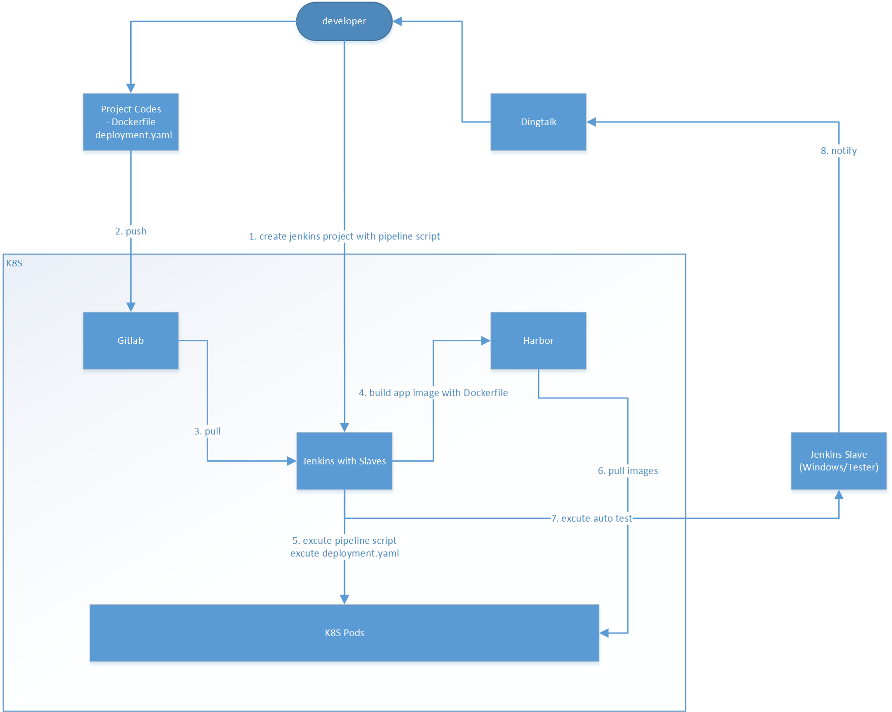

# 背景
在去年9月份的时候,我入职一家做航空软件产品的公司。当时公司部门领导决定构建一个技术平台(或称为技术中台),通过该技术平台进而孵化各个业务系统。说白了就是需要通过一个分布式框架或是微服务框架提高应用系统的性能和并发处理能力、业务处理能力。
当时现有的系统是在 .net framework平台上搭建的简单的单体应用，并不具备可用性、扩展性、易用性等。
我在入职前也学习过一些微服务相关的知识,并通过搜索引擎了解了.net平台下的一些微服务框架和分布式架构。在对比不同技术框架的背景后,我决定使用[surging](https://github.com/dotnetcore/surging)作为公司的技术平台。原因在于:
- Surging的设计思想和理念更符合微服务的架构思想,通过dotnetty框架实现的RPC通信,内置了服务治理保证通信的可靠性。
- 通过向服务注册中心(Zookeeper、Consul)注册相关元数据来管理集群的服务命令、路由信息、缓存中间件等数据,服务注册不需要进行额外的处理
- Surging内置了负载均衡算法。
- Surging支持多种协议的通信方式,并且支持ws服务主机与一般服务(Http、TCP)主机之间直接通过RPC进行通信。
- 服务之间的调用很方便,作者提供了基于`ServiceProxyProvider`、和基于`ServiceProxyFactory`的rpc调用方式,简单易用。
- 模块化设计,很方便的对模块进行扩展。
- 支持事件总线,通过消息对象实现的时效件纵向的适配可以实现发布订阅的交互模式。
- .net core 跨平台，性能更高。

# 架构维护
由于作者一直在维护surging,而且我们也需要对surging的一些模块进行调整,也需要扩展一些surging的组件包,所以我们在使用surging的过程中是直接获取源代码后,在公司维护一份自己的源码，然后打包成nuget包,并发布到内部的nuget服务，通过内部的nuget对surging组件进行分发。
在获取surging源码后,我对surging进行了如下调整：
1. 根据公司要求,对名称空间和包名称进行了调整。
2. 对异常处理进行了重构
3. 将消息返回的数据结果名称重命名为Data,统一了消息返回码。
4. 修改了默认的json序列化器,默认使用camelCame风格
5. 重构了签发token的方法(使用jose-jwt组件)
6. 支持通过RpcContext设置token的payload和获取payload,通过扩展`RpcContextSession`获取运行时登录用户
7. 扩展了Dapper、Domain、Validation、Schedule(基于Quartz的分布式任务调度)等组件包
8. swagger文档支持jwt token验证
9. 新增surging打包脚本等等
10. 现在surging的demo案例和内部的开发者文档

如果你在使用surging的过程中,对surging源码较为熟悉,并希望对surging进行一定的调整、扩展自己公司的一些组件的时候,您可以通过社区获取surging的源代码,并在公司的代码库维护自己的分支。但是需要对作者对源码的修改要及时了解和熟悉。
nuget服务的搭建可以使用nuget官方提供的[nuget.server](https://github.com/NuGet/NuGet.Server)或是[nexus](https://www.sonatype.com/nexus-repository-sonatype) 。
对架构的维护可能是一个持续的和长久的过程,你可以通过企业内部的需求和作者对框架的调整对技术框架持续的进行调整和维护。在对surging进行调整维护后,就通过通过打包脚本进行打包发布到内部的nuget服务。

# 业务框架

## 构建微服务主机
由于在构建每个微服务主机的代码和配置文件都是一致的,无法就是对配置文件的一些配置项进行调整，所以可以将构建微服务主机的代码和配置文件抽象出来,统一放置在`Shared`目录中，再在项目文件中通过`import`进入即可。
如何将公共的脚本、配置文件、属性抽象出来,可以参考:https://github.com/surging-cloud/Surging.Hero/tree/develop/hero/src/Shared 。 
如何构建主机呢?Surging通过`ServiceHostBuilder`来构建微服务主机,在构建主机过程中，可以添加一些服务组件或是指定相应的配置文件。构建主机的代码如下:
```csharp
var host = new ServiceHostBuilder()
                 .RegisterServices(builder =>
                 {
                     builder.AddMicroService(option =>
                      {
                          option.AddServiceRuntime()
                           .AddClientProxy()
                           .AddRelateServiceRuntime()
                           .AddConfigurationWatch()
                           .AddServiceEngine(typeof(SurgingServiceEngine))
                           ;

                          builder.Register(p => new CPlatformContainer(ServiceLocator.Current));
                      });
                 })
                 .ConfigureLogging(loggging =>
                 {
                     loggging.AddConfiguration(
                         AppConfig.GetSection("Logging"));
                 })
                 .UseServer(options => { })
                 .UseConsoleLifetime()
                 .Configure(build =>
                 {
#if DEBUG
                     build.AddCacheFile("${cachePath}|/app/configs/cacheSettings.json", optional: false, reloadOnChange: true);
                     build.AddCPlatformFile("${surgingPath}|/app/configs/surgingSettings.json", optional: false, reloadOnChange: true);
                     build.AddEventBusFile("${eventBusPath}|/app/configs/eventBusSettings.json", optional: false);
                     build.AddConsulFile("${consulPath}|/app/configs/consul.json", optional: false, reloadOnChange: true);


#else
                    build.AddCacheFile("${cachePath}|configs/cacheSettings.json", optional: false, reloadOnChange: true);                      
                    build.AddCPlatformFile("${surgingPath}|configs/surgingSettings.json", optional: false,reloadOnChange: true);                    
                    build.AddEventBusFile("configs/eventBusSettings.json", optional: false);
                    build.AddConsulFile("configs/consul.json", optional: false, reloadOnChange: true);
#endif
                 })
                 .UseProxy()
                 .UseStartup<Startup>()
                 .Build();

            using (host.Run())
            {
                Console.WriteLine($"服务主机启动成功{DateTime.Now}。");
            }
```
需要注意的是可以通过`SurgingServiceEngine`来指定surging服务引擎扫描的业务组件的目录。以及也可以通过`Startup`注入相应的服务或是制定配置文件。

## 业务框架的分层
一般地,我会将每个微服务组件分为如下几层:

### 1. Host
用于构建微服务主机和服务寄宿,一般我会直接引用Application层,托管应用服务本身。

### 2. IApplication 应用接口层
- 用于定义应用接口,每个应用接口都应当继承`IServiceKey`,Surging通过应用接口生成服务条目(`ServiceEntry`)
- 使用`ServiceBundle`特性来标识路由模板。
- 可以使用`ServiceCommand`来对Action进行注解,该元数据会被注册到服务注册中心,在RPC通信过程中，通过`ServiceCommand`注解的元数据实现服务治理。该特性可不需要配置,可以通过`SurgingSettings.json`统一指定相关的配置,如果配置了`ServiceCommand`特性,会优先选择特性指定的配置值。
- 可以通过`Service`特性指定Action的一些元数据。
- 应用接口层除了定义应用接口之外,还需要定义相关的DTO对象。
- 应用接口层可以被其他微服务组件应用或是通过nuget进行分发,通过`IServiceProxyFactory`创建应用接口的代理,从而实现RPC通信。

### 3. Application 应用层
- 应用层主要是实现业务流程和输入输出判断，不实现复杂的业务逻辑
- 应用层的应用需要实现应用接口定义的接口,并继承`ProxyServiceBase`,基类`ProxyServiceBase`提供了一些通用的方法。

### 4. Domain 领域层
- 领域层主要是实现具体的业务逻辑

### 5. Domian.Shared
- 定义微服务组件通用的值类型(model或是枚举类型),可被其他微服务组件引用

# 容器化服务和服务编排

## 服务容器化
docker是一款优秀的容器引擎产品。将服务容器化,能够最大化的发挥微服务的体验性。能够让开发者感受到docker构建一次,处处运行的魅力所在。所以我强烈推荐在开发过程中,使用docker容器化服务组件,使用docker-compose编排微服务组件。
vs对docker-compose进行开发调试提供了非常友好的体验性。
一般地,会在服务组件的Host层提供Dockerfile用于构建docker镜像。如下的dockerfile提供了微服务组件的编译、构建等过程。

```dockerfile
FROM microsoft/dotnet:2.2.0-runtime AS base
WORKDIR /app
ARG rpc_port=100
ARG http_port=8080
ARG ws_port=96
ENV TZ=Asia/Shanghai 
RUN ln -snf /usr/share/zoneinfo/$TZ /etc/localtime && echo $TZ > /etc/timezone 
EXPOSE ${rpc_port} ${http_port} ${ws_port}

FROM microsoft/dotnet:2.2-sdk AS build
WORKDIR /src
COPY . .
ARG sln_name
RUN dotnet restore ${sln_name} && \
    dotnet build --no-restore -c Release ${sln_name}

FROM build AS publish
ARG host_workdir
WORKDIR ${host_workdir}
RUN dotnet publish --no-restore -c Release -o /app

FROM base AS final
ARG host_name
ENV host_name=${host_name}
COPY --from=publish /app .
ENTRYPOINT dotnet ${host_name}
```
## 服务编排
使用docker-compose编排微服务组件,一般的,使用`docker-compose.yml`定义镜像构建的上下文、指定网络、镜像名称、挂载的目录等，通过`docker-compose.override.yml`来指定配置文件的环境变量，`.env`来设置环境变量的值,通过`docker-compose.vs.debug.yml`来指定调试过程中的相关设置(部署中可不指定该编排文件)。

需要注意的是,surging在开发过程中,基础服务也通过docker-compose来编排和启动,且必须在开发和调试前启动基础服务。基础服务和surging服务组件指定的网络必须同一个。

基础服务编排如下所示：
```yml
version: '3.7'

services:
  consul:
    image: consul:latest
    ports:
      - "8400:8400"
      - "8500:8500"
      - "8600:8600"
      - "8600:8600/udp"
    command: "agent -server -bootstrap-expect 1 -ui -client 0.0.0.0"
    networks:
      - surging_hero_service_net
  redis:
    image: redis:latest
    ports:
      - "6379:6379"
    networks:
      - surging_hero_service_net
  rabbitmq:
    image: rabbitmq:management
    environment:
      RABBITMQ_ERLANG_COOKIE: "SWQOKODSQALRPCLNMEQG"
      RABBITMQ_DEFAULT_USER: "rabbitmq"
      RABBITMQ_DEFAULT_PASS: "rabbitmq"
      RABBITMQ_DEFAULT_VHOST: "/"
    ports:
      - "15672:15672"
      - "5672:5672"
    networks:
      - surging_hero_service_net
      
networks:
  surging_hero_service_net: 
    driver: bridge
    name: surging_hero_service_net
    ipam:
      driver: default
      config:
      - subnet: 172.22.0.1/16
```
由于开发过程中的基础服务并没有考虑到高可用,在生产环境中建议基础服务集群化。

微服务组件的编排请参考: https://github.com/surging-cloud/Surging.Hero/tree/develop/hero/docker-compose/surging.hero

## 开发与调试
其实在开发过程中,由于业务模块的不同，责任人不同,开发团队不同，开发者拥有的权限不同,业务模块的代码有可能放到不同的git仓库。建议将微服务服务组件的应用接口层和Domian.Shared可以发布的企业内部的nuget服务。其他微服务组件可以通过nuget服务引用应用接口层和Domian.Shared组件。
如果源代码都放到一个git仓库中,也可以建立多个解决方案或是docker-compose编排文件项目来编排不同的服务，方便开发和调试。

## 常见问题
首次使用docker-compose进行调试服务时,由于vs会从网络上下载`vsdbg`组件,由于网络原因,一般都会比较慢,开发者可以从其他同事的电脑的家目录下拷贝`vsdbg`到本机,重新打开vs,然后再进行调试。

# Devops
## 业务流程
在开发过程中,我们使用Jenkins实现持续集成和部署。整个流程如下所述:
1. 开发者编写业务代码或修复完bug后,提交代码,push到远程仓库,并发起pr请求,请求合并到develop分支。
2. 当代码审核通过后,合并到develop分支后,通过设置`gitlab`或是`gitee`的`webhook`，触发jenkins执行构建。或是通过设置Jenkins的定时任务检测代码库变化,当代码库变化后,jenkins获取最新代码,执行构建操作(由于当时我们Jenkins部署的环境是内网,gitee无法访问公司内网,所以无法设置webhook)
3. Jenkins通过预先设置好的命令和脚本执行构建打包程序。本质上是执行`docker-compose build`打包docker镜像,当完成构建和打包docker镜像后,然后将镜像推送到企业内部的docker镜像仓库。
4. 之后,jenkins通过Jenkins SSH插件将部署脚本拷贝到k8集群的master节点,通过ssh插件在k8s master节点执行部署命令。完成后,微服务集群将自动部署到指定的k8s集群中。

整个devops流程如下所述(但是我们没有与钉钉做集成):


## 注意事项
1. 企业内部的docker仓库除了可以使用`harbor`搭建之外,还可以使用`nexus`。推荐使用`nexus`作为仓库管理服务，因为`nexus`除了支持docker镜像仓库之外,还支持nuget包、npm等格式的包管理。
2. 建议企业内部在构建业务平台时,根据业务模块划分主题,一个主题对应一个数据库,一个git仓库,一个项目组,多个相关的微服务组件，一个Jenkins构建项目。每个主题独立的进行持续集成与部署。
3. 建议基础服务consul、rabbitmq、redis考虑集群。

# 产品交付和部署
1. 一般的，我们通过docker镜像完成产品交付与部署。可以通过编写部署脚本在k8s集群或是通过rancher进行部署。
2. 可以使用k8s或是rancher提供的Dashborad进行容器和服务的监控和管理。

# 体会
1. surging的设计思想是无疑正确的。相比于市面上其他的.net微服务框架或是分布式框架,无论是服务治理还是内部通信机制,服务引擎设置，主机寄宿均有独到之处。(abp vnext的微服务框架通过内部网关Ocelot进行通信,完全违反的去中心化设计，而且性能也相对较差的多)
2. 在使用surging的过程中,也遇到了一些问题或是bug(例如:1.首次访问性能较差；2.服务实例无法支持同时扩展),在反馈到github社区或是请求作者协助,都能够得到及时反馈。目前作者已经即将完成对surging2.0的开发，相信会有更优秀的体验。
3. 在开发和测试、部署和产品交付中推荐将服务容器化，推荐使用linux作为部署服务器。

# 最后
- 如果你对surging感兴趣,可以在github上对[surging](https://github.com/dotnetcore/surging)关注。
- 如果你对如何使用surging落地开发，您可以在github上关注[surging.hero](https://github.com/surging-cloud)。
  -  surging.hero是一个使用surging作为开发框架的权限管理平台。目前项目刚刚开始,欢迎各位开发者加入,如果您想加入surging.hero的开发或是愿意为surging的生态做出贡献,欢迎加入`surging-cloud`社区。
  - 如果你希望加入`surging-cloud`社区，可以将你的github账号通过email到:1029765111@qq.com,并备注`申请加入 **surging-cloud社区** 即可。
  - 如果您对surging.hero感兴趣并希望加入surging.hero的开发,也可以申请加入qq群:`713943626`。
- 如果大家对surging确实感兴趣,后期我有时间的话,可以写一些我使用surging的经验或是对源码的理解。